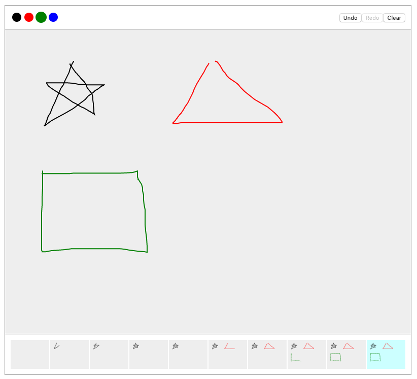

<div align="center">
  <p>
    
  </p>
  <h1>useStateSnapshots</h1>
  <p>A React hook to keep track of state changes for undo/redo functionality.</p>
  <p>
    
    
  </p>
</div>

## Demo

https://codesandbox.io/s/use-state-snapshots-i6fuq



## Features

- Drop-in replacement for [useState](https://reactjs.org/docs/hooks-reference.html#usestate) including support for [functional updates](https://reactjs.org/docs/hooks-reference.html#functional-updates) and [lazy initial state](https://reactjs.org/docs/hooks-reference.html#lazy-initial-state).
- Three ways to track changes:
  - Automatically create new snapshots at regular intervals.
  - Automatically create a snapshot for every single change to state.
  - Only create snapshots for specific changes to state.
- Snapshots include timestamps and ID's so you can display a timeline of changes.
- Configurable limit for the number of snapshots to keep.
- Flow and TypeScript declarations included.
- Zero dependencies.

## Install

NPM:

```shell
npm install use-state-snapshots
```

Yarn:

```shell
yarn add use-state-snapshots
```

## Basic Usage

```jsx
import React from "react";
import useStateSnapshots from "use-state-snapshots";

const MyComponent = () => {
  const [state, setState, pointer, setPointer] = useStateSnapshots("Hello");
  return (
    <div>
      <textarea
        value={state}
        onChange={event => {
          setState(event.target.value);
        }}
      />
      <button
        onClick={() => {
          setPointer(pointer - 1);
        }}
      >
        Undo
      </button>
      <button
        onClick={() => {
          setPointer(pointer + 1);
        }}
      >
        Redo
      </button>
    </div>
  );
};
```

## API

### useStateSnapshots

```js
const [state, setState, pointer, setPointer, snapshots] = useStateSnapshots(
  initialState,
  delay,
  limit
);
```

The `initialState` argument and the `state` value behave exactly as they do for the [useState](https://reactjs.org/docs/hooks-reference.html#usestate) hook.

The `delay` argument is the number of milliseconds to wait before automatically creating a new snapshot. When set to `false` the automatic snapshots behaviour is disabled and when set to `0` a new snapshot will be created every time `setState` is called. Default value: `2000`.

The `limit` argument is the number of snapshots to keep. When the limit is reached the oldest snapshot will be removed before when adding a new one. Default value: `Number.MAX_SAFE_INTEGER`.

```js
const { id, state, firstChange, lastChange } = snapshots[pointer];
```

The `pointer` value returned is the index of the current snapshot in `snapshots`.

Along with `state` each snapshot has a unique `id` as well as `firstChange` and `lastChange` timestamps indicating when the earliest and most recent changes in that snapshot occurred (these are generated with `Date.now()`).

### setState

```js
setState(newState, forceSnapshot);
```

The `setState` function works just as described in the [useState](https://reactjs.org/docs/hooks-reference.html#usestate) documentation, with the exception of an additional `forceSnapshot` argument. When the `forceSnapshot` argument is `true` a new snapshot will be created irrespective of the amount of time that has passed since the last snapshot was created.

### setPointer

```js
setPointer(index);
```

The `index` argument is the index of the snapshot the `snapshots` list you want to restore. If a value less than 0 or greater than the length of the snapshots list it will be automatically clamped to the lowest (`0`) or highest (`snapshots.length - 1`) allowed value.

## Functional Updates

Both `setState` and `setPointer` accept functional updates as explained in
the [useState documentation](https://reactjs.org/docs/hooks-reference.html#functional-updates).

## Alternatives

- [use-simple-undo](https://github.com/sandiiarov/use-simple-undo) by [@sandiiarov](https://github.com/sandiiarov)
- [use-state-history](https://github.com/carlomartinucci/use-state-history) by [@carlomartinucci](https://github.com/carlomartinucci)
- [use-undo](https://github.com/xxhomey19/use-undo) by [@xxhomey19](https://github.com/xxhomey19)
- [useHistory](https://codesandbox.io/s/yv3004lqnj) by [@juice49](https://github.com/juice49)
- [useHistory](https://usehooks.com/useHistory/) by [@gragland](https://github.com/gragland)
- [useTimeTravel](https://frontarm.com/swyx/reusable-time-travel-react-hooks-immer/) by [@sw-yx](https://github.com/sw-yx)

## Roadmap

- Document browser compatibility.
- Add tests.
- Create a `useReducerSnapshots` hook.
